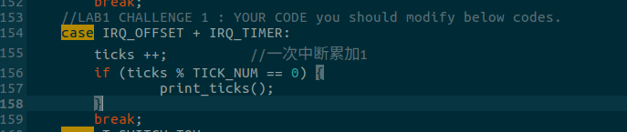
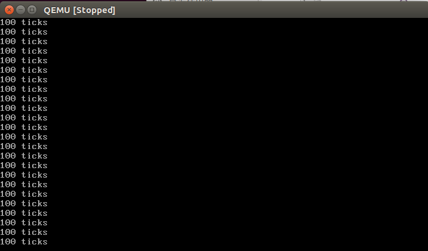

# ucore实验报告---LAB1
## 练习1
>理解通过 make 生成执行文件的过程。(要求在报告中写出对下述问题的回答)
在此练习中,大家需要通过阅读代码来了解:
>1. 操作系统镜像文件 ucore.img 是如何一步一步生成的?(需要比较详细地解释 Makefile 中每一条相关命令和命令参数的含义,以及说明命令导致的结果)
>2. 一个被系统认为是符合规范的硬盘主引导扇区的特征是什么?

### 练习1.1
>$(UCOREIMG): $(kernel) $(bootblock)   
>    $(V)dd if=/dev/zero of=$@ count=10000   
>    $(V)dd if=$(bootblock) of=$@ conv=notrunc   
>   $(V)dd if=$(kernel) of=$@ seek=1 conv=notrunc  
>$(call create_target,ucore.img)

首先先创建一个大小为10000字节的块儿，然后拷贝bootblock，根据上述代码，我们知道生成镜像文件，首先要生成kernel和bootblock

生成kernel：
>$(kernel): tools/kernel.ld  
>$(kernel): $(KOBJS)  
    >@echo "bbbbbbbbbbbbbbbbbbbbbb$(KOBJS)"  
   >@echo + ld $@  
    >$(V)$(LD) $(LDFLAGS) -T tools/kernel.ld -o $@ $(KOBJS)  
    >@$(OBJDUMP) -S $@ > $(call asmfile,kernel)  
    >@$(OBJDUMP) -t $@ | $(SED) '1,/SYMBOL TABLE/d; s/ .* / /; /^$$/d' > $>>(call symfile,kernel)  

通过make V=指令得到执行的具体命令,生成kernel，需要用GCC编译器将kern目录下所有的.c文件全部编译生成.o文件(其实个人感觉就是需要make对.c文件进行编译)

生成bootblock：
>$(bootblock): $(call toobj,$(bootfiles)) | $(call totarget,sign)   
    >@echo "========================$(call toobj,$(bootfiles))"  
    >@echo + ld $@  
    >$(V)$(LD) $(LDFLAGS) -N -e start -Ttext 0x7C00 $^ -o $(call toobj,bootblock)  
    >@$(OBJDUMP) -S $(call objfile,bootblock) > $(call asmfile,bootblock)  
    >@$(OBJCOPY) -S -O binary $(call objfile,bootblock) $(call outfile,bootblock)  
    >@$(call totarget,sign) $(call outfile,bootblock) $(bootblock)

同样根据make V=指令打印的结果，得到要生成bootblock，首先需要生成bootasm.o、bootmain.o、sign

附：生成sign的代码
>$(call add_files_host,tools/sign.c,sign,sign)  
>$(call create_target_host,sign,sign)
### 练习1.2
一个被系统认为是符合规范的硬盘主引导扇区的特征有以下几点：
- 磁盘主引导扇区只有512字节
- 磁盘最后两个字节为0x55AA
- 由不超过466字节的启动代码和不超过64字节的硬盘分区表加上两个字节的结束符组成

## 练习2
>1.从 CPU加电后执行的第一条指令开始，单步跟踪 BIOS的执行。  
>2.在初始化位置 0x7c00 设置实地址断点,测试断点正常。  
>3.从 0x7c00 开始跟踪代码运行,将单步跟踪反汇编得到的代码与 bootasm.S和 bootblock.asm进行比较。  
>4.自己找一个 bootloader或内核中的代码位置，设置断点并进行测试

首先通过make qemu指令运行出等待调试的qemu虚拟机，然后再打开一个终端，通过下述命令连接到qemu虚拟机：
>gdb  
>target remote 127.0.0.1:1234

进入到调试界面：

输入si命令单步调试，
这是另一个终端会打印下一条命令的地址和内容

然后输入b*0x7c00在初始化位置地址0x7c00设置上断点

然后输入continue使之继续运行

这时成功在0x7c00处停止运行，然后我们查看此处的反汇编代码，如下

对比此时bootasm.S中的起始代码，发现确实是一样的
	----------------
	IN: 
	0x00007c00:  cli    
	
	----------------
	IN: 
	0x00007c01:  cld    
	0x00007c02:  xor    %ax,%ax
	0x00007c04:  mov    %ax,%ds
	0x00007c06:  mov    %ax,%es
	0x00007c08:  mov    %ax,%ss
	
	----------------
	IN: 
	0x00007c0a:  in     $0x64,%al
	
	----------------
	IN: 
	0x00007c0c:  test   $0x2,%al
	0x00007c0e:  jne    0x7c0a
	
	----------------
	IN: 
	0x00007c10:  mov    $0xd1,%al
	0x00007c12:  out    %al,$0x64
	0x00007c14:  in     $0x64,%al
	0x00007c16:  test   $0x2,%al
	0x00007c18:  jne    0x7c14
	
	----------------
	IN: 
	0x00007c1a:  mov    $0xdf,%al
	0x00007c1c:  out    %al,$0x60
	0x00007c1e:  lgdtw  0x7c6c
	0x00007c23:  mov    %cr0,%eax
	0x00007c26:  or     $0x1,%eax
	0x00007c2a:  mov    %eax,%cr0
	
	----------------
	IN: 
	0x00007c2d:  ljmp   $0x8,$0x7c32
	
	----------------
	IN: 
	0x00007c32:  mov    $0x10,%ax
	0x00007c36:  mov    %eax,%ds
	
	----------------
	IN: 
	0x00007c38:  mov    %eax,%es
	
	----------------
	IN: 
	0x00007c3a:  mov    %eax,%fs
	0x00007c3c:  mov    %eax,%gs
	0x00007c3e:  mov    %eax,%ss
	
	----------------
	IN: 
	0x00007c40:  mov    $0x0,%ebp
	
	----------------
	IN: 
	0x00007c45:  mov    $0x7c00,%esp
	0x00007c4a:  call   0x7d0d
	
	----------------
	IN: 
	0x00007d0d:  push   %ebp

附加：单步跟踪调试:  
1 修改 lab1/tools/gdbinit,内容为:
>set architecture i8086  
>target remote :1234  
>//file bin/kernel  
>//target remote :1234  
>//break kern_init  
>//continue

2 在 lab1目录下，执行  
>make debug  

3 在看到gdb的调试界面(gdb)后，在gdb调试界面下执行如下命令  
>si  
即可单步跟踪BIOS了。  

4 在gdb界面下，可通过如下命令来看BIOS的代码  
>x /2i $pc  //显示当前eip处的汇编指令

## 练习3
>分析从bootloader进入保护模式的过程。BIOS 将通过读取硬盘主引导扇区到内存，并转跳到对应内存中的位置执行 bootloader。请分析bootloader是如何完成从实模式进入保护模式的

1、关闭中断，将各个段寄存器重置
>cli               # Disable interrupts  
>cld               # String operations increment  
>xorw %ax, %ax     # Segment number zero  
>movw %ax, %ds     # -> Data Segment  
>movw %ax, %es     # -> Extra Segment  
>movw %ax, %ss     # -> Stack Segment

2.开启A20
然后就是将A20置1，简单解释一下A20，当 A20 地址线控制禁止时，则程序就像在 8086 中运行，1MB 以上的地是不可访问的。而在保护模式下 A20 地址线控制是要打开的，所以需要通过将键盘控制器上的A20线置于高电位，使得全部32条地址线可用。
>seta20.1:  
    >inb $0x64, %al    # 读取状态寄存器,等待8042键盘控制器闲置  
    >testb $0x2, %al   # 判断输入缓存是否为空  
    >jnz seta20.1  
    >movb $0xd1, %al    # 0xd1表示写输出端口命令，参数随后通过0x60端口写入  
    >outb %al, $0x64     
>seta20.2:  
    inb $0x64, %al      
    testb $0x2, %al  
    jnz seta20.2  
    movb $0xdf, %al   # 通过0x60写入数据11011111 即将A20置1  
    outb %al, $0x60   

3、加载GDT表
>lgdt gdtdesc

4、将CR0的第0位置1
>movl %cr0, %eax  
    orl $CR0_PE_ON, %eax  
    movl %eax, %cr0

5、长跳转到32位代码段，重装CS和EIP
>ljmp $PROT_MODE_CSEG, $protcseg

6、重装DS、ES等段寄存器等
>movw $PROT_MODE_DSEG, %ax   # Our data segment selector  
>movw %ax, %ds     # -> DS: Data Segment  
movw %ax, %es     # -> ES: Extra Segment  
movw %ax, %fs     # -> FS  
movw %ax, %gs     # -> GS  
movw %ax, %ss     # -> SS: Stack Segment

7、转到保护模式完成，进入boot主方法
>movl $0x0, %ebp  
movl $start, %esp  
call bootmain

## 练习4
>分析bootloader加载ELF格式的OS的过程
>1. bootloader如何读取硬盘扇区的？
>2. bootloader是如何加载 ELF格式的 OS？  
>这里主要分析是bootmain函数，

>bootmain(void) {  
    readseg((uintptr_t)ELFHDR, SECTSIZE * 8, 0);  
    if (ELFHDR->e_magic != ELF_MAGIC) {  
        goto bad;  
    }  
    struct proghdr *ph, *eph;  
    ph = (struct proghdr *)((uintptr_t)ELFHDR + ELFHDR->e_phoff);  
    eph = ph + ELFHDR->e_phnum;  
    for (; ph < eph; ph ++) {  
        readseg(ph->p_va & 0xFFFFFF, ph->p_memsz, ph->p_offset);  
    }  
    ((void (*)(void))(ELFHDR->e_entry & 0xFFFFFF))();  
bad:  
    outw(0x8A00, 0x8A00);  
    outw(0x8A00, 0x8E00);  
    while (1);  
}

bootloader读取硬盘扇区
根据上述bootmain函数分析，首先是由readseg函数读取硬盘扇区，而readseg函数则循环调用了真正读取硬盘扇区的函数readsect来每次读出一个扇区 (其实这个在源代码中都有注释的)
>readsect(void *dst, uint32_t secno) {  
    waitdisk(); // 等待硬盘就绪  
    // 写地址0x1f2~0x1f5,0x1f7,发出读取磁盘的命令  
    outb(0x1F2, 1);  
    outb(0x1F3, secno & 0xFF);  
    outb(0x1F4, (secno >> 8) & 0xFF);  
    outb(0x1F5, (secno >> 16) & 0xFF);  
    outb(0x1F6, ((secno >> 24) & 0xF) | 0xE0);  
    outb(0x1F7, 0x20);  
    waitdisk();  
    insl(0x1F0, dst, SECTSIZE / 4);//读取一个扇区  
}

bootloader加载 ELF格式的 OS
读取完磁盘之后，开始加载ELF格式的文件
>bootmain(void) {  
    ..........  
    //首先判断是不是ELF  
    if (ELFHDR->e_magic != ELF_MAGIC) {  
        goto bad;                   
    }  
    struct proghdr *ph, *eph;  
    //ELF头部有描述ELF文件应加载到内存什么位置的描述表，这里读取出来将之存入ph  
    ph = (struct proghdr *)((uintptr_t)ELFHDR + ELFHDR->e_phoff);  
    eph = ph + ELFHDR->e_phnum;  
    //按照程序头表的描述，将ELF文件中的数据载入内存  
    for (; ph < eph; ph ++) {  
        readseg(ph->p_va & 0xFFFFFF, ph->p_memsz, ph->p_offset);  
    }  
    //根据ELF头表中的入口信息，找到内核的入口并开始运行   
    ((void (*)(void))(ELFHDR->e_entry & 0xFFFFFF))();  
bad:  
    ..........  
}

## 练习5
>完成kdebug.c中函数print_stackframe的实现，可以通过函数>print_stackframe来跟踪函数调用堆栈中记录的返回地址。

根据注释我们可以更好地编写代码
```
void
print_stackframe(void) {
     /* LAB1 YOUR CODE : STEP 1 */
     /* (1) call read_ebp() to get the value of ebp. the type is (uint32_t);
      * (2) call read_eip() to get the value of eip. the type is (uint32_t);
      * (3) from 0 .. STACKFRAME_DEPTH
      *    (3.1) printf value of ebp, eip
      *    (3.2) (uint32_t)calling arguments [0..4] = the contents in address (unit32_t)ebp +2 [0..4]
      *    (3.3) cprintf("\n");
      *    (3.4) call print_debuginfo(eip-1) to print the C calling function name and line number, etc.
      *    (3.5) popup a calling stackframe
      *           NOTICE: the calling funciton's return addr eip  = ss:[ebp+4]
      *                   the calling funciton's ebp = ss:[ebp]
      */
}
```
然后我么你对应的实现代码即可,具体的函数需要查看接口

```
void print_stackframe(void) {      
    uint32_t ebp=read_ebp();		//(1) call read_ebp() to get the value of ebp. the type is (uint32_t)
    uint32_t eip=read_eip();		//(2) call read_eip() to get the value of eip. the type is (uint32_t)
    for(int i=0;i<STACKFRAME_DEPTH&&ebp!=0;i++){	//(3) from 0 .. STACKFRAME_DEPTH
          cprintf("ebp:0x%08x   eip:0x%08x ",ebp,eip);	//(3.1)printf value of ebp, eip
          uint32_t *tmp=(uint32_t *)ebp+2;
          cprintf("arg :0x%08x 0x%08x 0x%08x 0x%08x",*(tmp+0),*(tmp+1),*(tmp+2),*(tmp+3));	//(3.2)(uint32_t)calling arguments [0..4] = the contents in address (unit32_t)ebp +2 [0..4]
          cprintf("\n");			//(3.3) cprintf("\n");
          print_debuginfo(eip-1);	//(3.4) call print_debuginfo(eip-1) to print the C calling function name and line number, etc.
          eip=((uint32_t *)ebp)[1];
          ebp=((uint32_t *)ebp)[0];	//(3.5) popup a calling stackframe
      }
}
```
## 练习6
>1.中断向量表中一个表项占多少字节？其中哪几位代表中断处理代码的入口？  
>2.中断向量表一个表项占用8字节，其中2-3字节是段选择子，0-1字节和6-7字节拼成位移，
两者联合便是中断处理程序的入口地址。   
3.请编程完善kern/trap/trap.c中对中断向量表进行初始化的函数idt_init。  
4.请编程完善trap.c中的中断处理函数trap，在对时钟中断进行处理的部分填写trap函数

中断向量表一个表项占用8字节，其中2-3字节是段选择子，0-1字节和6-7字节拼成位移，
两者联合便是中断处理程序的入口地址。
跟上一题一样，完全按照注释与给出的文档里的信息来补全代码。
```
void idt_init(void) {
     /* LAB1 YOUR CODE : STEP 2 */
     /* (1) Where are the entry addrs of each Interrupt Service Routine (ISR)?
      *     All ISR's entry addrs are stored in __vectors. where is uintptr_t __vectors[] ?
      *     __vectors[] is in kern/trap/vector.S which is produced by tools/vector.c
      *     (try "make" command in lab1, then you will find vector.S in kern/trap DIR)
      *     You can use  "extern uintptr_t __vectors[];" to define this extern variable which will be used later.
      * (2) Now you should setup the entries of ISR in Interrupt Description Table (IDT).
      *     Can you see idt[256] in this file? Yes, it's IDT! you can use SETGATE macro to setup each item of IDT
      * (3) After setup the contents of IDT, you will let CPU know where is the IDT by using 'lidt' instruction.
      *     You don't know the meaning of this instruction? just google it! and check the libs/x86.h to know more.
      *     Notice: the argument of lidt is idt_pd. try to find it!
      */
}
```
填充的代码为

```
void idt_init(void) {
	extern uintptr_t __vectors[];			//声明__vertors[],其中存放着中断服务程序的入口地址
	int i;
	for(i=0;i<256;i++) {
		SETGATE(idt[i],0,GD_KTEXT,__vectors[i],DPL_KERNEL);
	 }
	SETGATE(idt[T_SWITCH_TOK],0,GD_KTEXT,__vectors[T_SWITCH_TOK],DPL_USER);		//填充中断描述符表IDT
	lidt(&idt_pd);				//使用lidt指令加载中断描述符表			
}
```
请编程完善 trap.c 中的中断处理函数 trap,在对时钟中断进行处理的部分填写 trap 函数中处理时钟中断的部分,使操作系统每遇到 100 次时钟中断后,调用 print_ticks 子程序,向屏幕上打印一行文字”100 ticks”。 
<div align=center></div>
效果图如下
<div align=center></div>